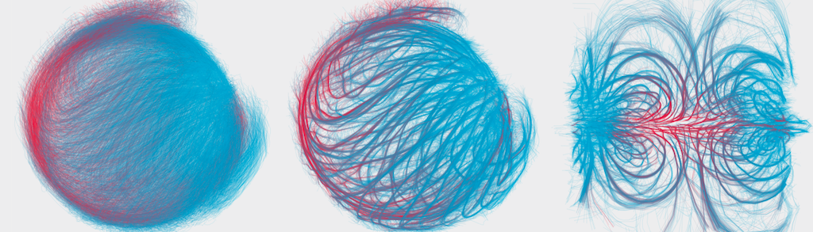

# Multi-scale imaging and analysis identify pan-embryo cell dynamics of germlayer formation in zebrafish

This repository contains the code to analyse and visualize cellular dynamics as presented in 

- Shah,G. _et al._ (2017) Pan-embryo cell dynamics of germlayer formation in zebrafish. _bioRxiv_, 173583.
[preprint available at bioRxiv](https://www.biorxiv.org/content/10.1101/173583v2)

## overview

## additional resources

### data to run examples in this repository

Data can be found as a zip archive (678 MB) at https://www.dropbox.com/sh/c21o07dsk9l7m6n/AABVQz12QdWvKkDf_OnJOUn_a?dl=0
Unzip from main folder of this repository creates the default _test-data_ subfolder that is used in the notebook examples. If you choose another location for the data, the notebooks need to be adapted accordingly.

### image and tracking data
The image data (3D + time, 3 channels) for sample 1 is available for download at [IDR](https://idr.openmicroscopy.org/search/?query=Name:idr0068).
Processed cell tracks to reproduce the plots in the notebooks is available at (link coming soon)

### Eidomatica
a custom Mathematica library for the analysis of tracking data 

- follow installation instructions at https://github.com/kthr/Eidomatica 
- follow installation instructions at https://github.com/kthr/libEidomatica

